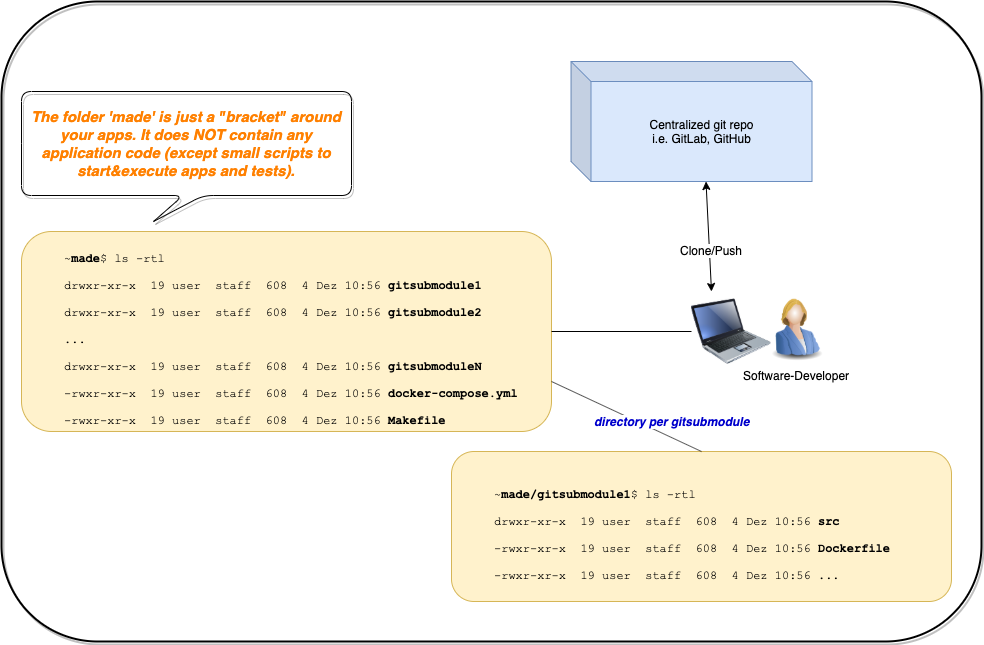

# Blueprint MADE - (M)icroservice Test (A)nd (D)evelopment (E)nvironment

## What is MADE ?

First of all, `MADE` is not a tool. It's a method/technique to manage and test your microservices in a reproducible and reliable way. 
Basically it is made for LOCAL develepment. But if you have a `docker-compose` capable CI/CD pipeline you could even use the same approach to deploy your apps to staging or production.  

_Scenario_: Imagine you have a microservice architecture with a frontend (e.g. React/Angular), 
backend (Kotlin, Python, Java, ...), a database (Mongo, PostgreSQL, ...) and other third-party services (i.e. ElasticSearch, KeyCloak for AAA).
Maybe you also have some automated integration and/or system-tests.

How can you then configure, run, test and maintain all these apps in a composed environment?
Here comes `MADE` into play!

The idea is:

1. Manage source-code of all required microservices - `using git (specifically git-submodules)`
2. Build all apps - `using Docker`
3. Compose, configure, start and run all apps and tests in a reproducible and reliable way - `using Docker-Compose`

Other requirements developers may have:
1. Develop locally and independently on your machine. So no permanent internet connection required. Especially useful when you are sitting in the train (Greetz to DB ;-))
2. Setup for tests must be reliable and reproducible. When its working for one developer then it must also work for any other developer!
3. Developers want to be able to test against "incomplete" features/code. Imagine backend API changes and the frontend developer wants to code against this new API in a very early stage.
4. No central test environments (like test-clusters in the cloud) which you need to share with other developers. Error-Prone and many conflicts are related to that.

All this will be covered by MADE!

## Prerequisites

All you need is `git`, `docker` and `docker-compose`. 

## Overview / Structure
The core of `MADE` is `git`, `docker` and `docker-compose`, as mentioned before.

* With `git` you can manage the versions of your apps. You can checkout any commit you want i.e. frontend has feature-branch X, backend has master-branch etc.. 
By that you can create any combination of your apps very fast and easily. 
    * Here we use `git submodules`. A git submodule is just a reference to another git repo. 
    Since all your apps should already have a separate git repo, we can leverage that!
* `docker` (of course ;-) ) is needed to build and package your apps into docker images. 
Same images will be deployed to your production/staging environment (ie. GoogleCloud, MS Azure) since your CI/CD pipeline SHOULD use the same Dockerfile.
* `docker-compose` gives us a tool to compose and configure the microservice environment. We will also use it to include and start the automated tests. 

<table><tr><td>

</td></tr></table>

### Automated tests

Since we can setup our entire microservice environment locally, we can also execute tests against this environment, in best case automated tests. 
The tests are managed in a separate gitsubmodule which also includes a Dockerfile. So its treated as ordinary microservice/app.

In this microservice we manage the tests which you can write in any language and with any framework you want. 
We have used  [behave](https://behave.readthedocs.io/en/latest/) (BDD tests) and for automated UI tests we used [Cypress](https://www.cypress.io/). But feel free use whatever you like!

### Managing secrets in MADE (optionally)
One specific requirement we had in the past, was that we also wanted to access from local running apps to remote databases in our clouds (i.e. GCloud).
For that you need to store the secrets, such as passwords or api-keys, somehow.

To avoid comitting/pushing those secrets to `git` we use the `env` folder approach. 
That means we have a folder `made/env` which is ignored by `git` (see .gitignore). 
In that folder we store the secrets in special .env-files which are used then by `docker-compose`.

## Working with MADE

### Clone me
```
git clone --recursive git@gitlab.pwc.delivery:fs-acc-devops/platform_blueprint.git
```

### Create your own git repo of MADE
Remove `.git` folder because this is the git repo for this blueprint. 
I guess you wanna create your own platform repo ;-).
```
$ rm -rf .git
$ git init
```

### Adding a git submodule (microserice/app)

You add a new gitsubmodule, in other words another git-repo, just execute in MADE root-folder:
```
~made$ git submodule add git@gitlab.pwc.delivery:/awsome_app.git
```
After that you can execute:
```
~made$ git submodule
5201ad9806d8f9d4d18ff296dcb433f86bf7c5c4 awsome_app (heads/master)
```